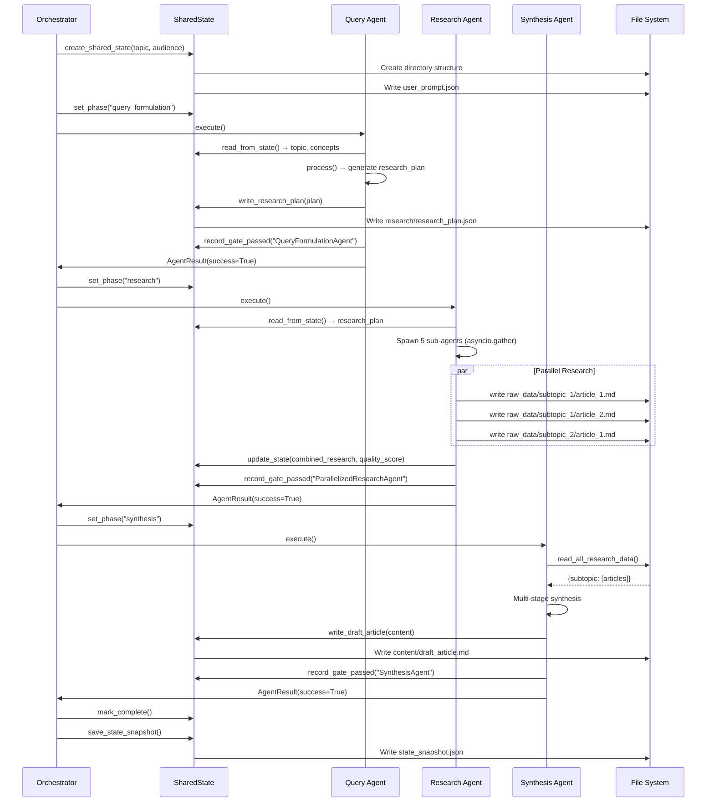
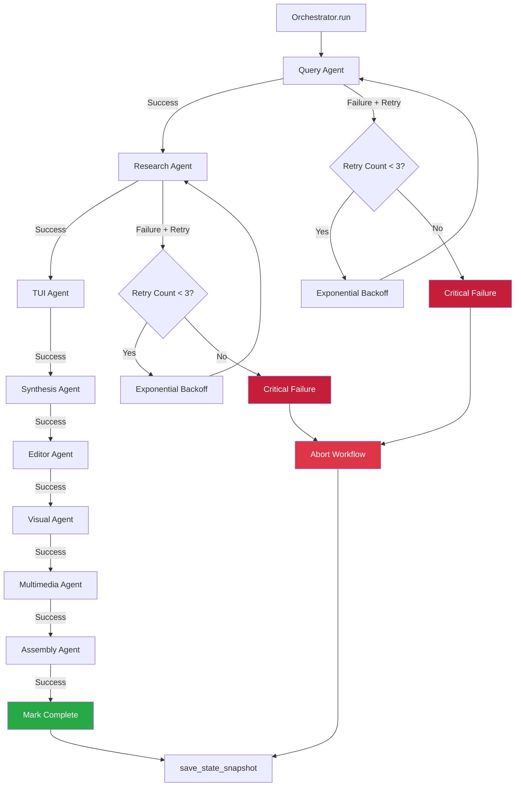

# Ralph Deep Agents System - Architecture Analysis

**Analysis Date:** 2026-03-24
**Analyst:** Architecture Analyst
**System:** Ralph Newsletter Generation Pipeline

---

## Executive Summary

The Ralph system implements a sophisticated **8-agent pipeline architecture** for autonomous newsletter generation. The system follows a **sequential orchestration pattern** with **shared state management**, **quality gates**, and **exponential backoff retry mechanisms** for robust production deployment.

**Key Architectural Patterns:**
- **Hub-and-Spoke Orchestration**: Central orchestrator coordinates sequential agent execution
- **Shared State Pattern**: File-based hierarchical state with in-memory overlay
- **Map-Reduce Research**: Parallelized sub-agents for concurrent research execution
- **Multi-Stage Content Generation**: Insight extraction → structure → section writing → assembly
- **Quality Gate Validation**: Non-negotiable quality thresholds at each phase
- **Exponential Backoff Retry**: Resilient failure handling with configurable retry policies

---

## 1. Agent Integration Map

### 1.1 Agent Pipeline Overview

The 8 agents execute in strict sequential order:

```
1. Query Formulation Agent
   ↓
2. Parallelized Research Agent (5-10 concurrent sub-agents)
   ↓
3. TUI Strategy Analysis Agent
   ↓
4. Synthesis Agent (multi-stage: insights → structure → writing)
   ↓
5. HBR Editor Agent
   ↓
6. Visual Asset Agent
   ↓
7. Multimedia Agent
   ↓
8. Final Assembly Agent
```

### 1.2 Input/Output Contracts Between Agents

#### **Agent 1: Query Formulation → Agent 2: Research**

**Input Contract (Query Formulation reads):**
```python
# From shared_state.state
- topic: str
- key_concepts: list[str]
- sub_topics: list[dict]
- target_audience: str
```

**Output Contract (Research expects):**
```python
# Written to shared_state via write_research_plan()
{
    "main_topic": str,
    "target_audience": str,
    "tui_source": str,
    "total_sources": int,
    "research_plan": [
        {
            "sub_topic": str,
            "queries": list[str],  # 3-5 optimized queries
            "sources": list[str],  # 3-5 selected sources
            "focus_areas": list[str]
        }
    ]
}
```

**File Artifacts:**
- `shared_state/input/research_plan.json`

---

#### **Agent 2: Research → Agent 3: TUI Analysis**

**Input Contract (Research reads):**
```python
# research_plan from state
research_plan["research_plan"]: list[dict]
```

**Output Contract (TUI Analysis expects):**
```python
# Written via write_research_data() for each subtopic
{
    "total_articles": int,
    "articles_by_subtopic": {
        "subtopic_name": [
            {
                "title": str,
                "url": str,
                "content": str,  # Full text extraction
                "source": str,
                "word_count": int
            }
        ]
    },
    "sources_used": list[str],
    "quality_score": float
}
```

**File Artifacts:**
- `shared_state/research/raw_data/<subtopic>/article_1.md`
- `shared_state/research/raw_data/<subtopic>/article_2.md`
- Multiple markdown files per subtopic

---

#### **Agent 3: TUI Analysis → Agent 4: Synthesis**

**Input Contract (TUI Analysis reads):**
```python
# All research data from files
research_data = shared_state.read_all_research_data()
# Returns: dict[str, list[dict]]
```

**Output Contract (Synthesis expects):**
```python
# Written via write_tui_strategy_summary()
{
    "summary_path": str,
    "content": str  # Strategic TUI context
}
```

**File Artifacts:**
- `shared_state/research/tui_strategy_summary.md`

---

#### **Agent 4: Synthesis → Agent 5: Editor**

**Input Contract (Synthesis reads):**
```python
{
    "topic": str,
    "target_audience": str,
    "research_data": dict[str, list[dict]],  # All research
    "tui_strategy": str,  # TUI summary
    "combined_research_summary": str
}
```

**Output Contract (Editor expects):**
```python
{
    "title": str,
    "subtitle": str,
    "content": str,  # 2500-3500 words
    "word_count": int,
    "sections": list[dict],
    "key_insights": list[str],
    "counterintuitive_insights": list[str],
    "reading_time_minutes": float
}
```

**File Artifacts:**
- `shared_state/content/draft_article.md`

---

#### **Agent 5: Editor → Agent 6: Visual Assets**

**Input Contract (Editor reads):**
```python
draft_article = shared_state.read_draft_article()
```

**Output Contract (Visual Assets expects):**
```python
# final_article.md (edited, polished)
{
    "article_content": str,
    "word_count": int,  # 2000-2500
    "readability_score": float,
    "hbr_quality_score": float
}
```

**File Artifacts:**
- `shared_state/content/final_article.md`

---

#### **Agent 6: Visual Assets → Agent 7: Multimedia**

**Input Contract (Visual Assets reads):**
```python
{
    "article_content": str,
    "article_title": str,
    "topic": str,
    "key_insights": list[str]
}
```

**Output Contract (Multimedia expects):**
```python
{
    "assets": [
        {
            "filename": str,
            "type": str,  # "chart", "diagram", "architecture"
            "title": str,
            "file_path": Path,
            "quality_score": float
        }
    ],
    "total_generated": int
}
```

**File Artifacts:**
- `shared_state/visuals/chart_1.png`
- `shared_state/visuals/diagram_1.png`
- `shared_state/visuals/asset_manifest.json`

---

#### **Agent 7: Multimedia → Agent 8: Assembly**

**Input Contract (Multimedia reads):**
```python
{
    "article_content": str,
    "visual_assets": list[dict]
}
```

**Output Contract (Assembly expects):**
```python
{
    "audio_path": Optional[str],
    "video_path": Optional[str],
    "audio_duration_seconds": float,
    "video_duration_seconds": float
}
```

**File Artifacts:**
- `shared_state/multimedia/audio_version.mp3`
- `shared_state/multimedia/promo_video.mp4`

---

#### **Agent 8: Final Assembly**

**Input Contract (Assembly reads):**
```python
{
    "article_content": str,
    "article_title": str,
    "visual_assets": list[dict],
    "multimedia": dict
}
```

**Output Contract (Final deliverables):**
```python
{
    "pdf_path": str,
    "html_path": str,
    "archive_path": str
}
```

**File Artifacts:**
- `shared_state/final_deliverables/Leadership_Strategy_Newsletter.pdf`
- `shared_state/final_deliverables/Leadership_Strategy_Newsletter.html`
- `shared_state/final_deliverables/newsletter_package.zip`

---

### 1.3 State Dependencies Summary

| Agent | Reads From State | Writes To State | File Artifacts |
|-------|-----------------|-----------------|----------------|
| **Query Formulation** | `topic`, `key_concepts`, `sub_topics` | `research_plan` | `research_plan.json` |
| **Research** | `research_plan` | `combined_research`, `research_results` | `raw_data/<subtopic>/*.md` |
| **TUI Analysis** | `research_data` (from files) | `tui_analysis`, `tui_summary` | `tui_strategy_summary.md` |
| **Synthesis** | `research_data`, `tui_strategy` | `article_content`, `synthesized_content` | `draft_article.md` |
| **Editor** | `draft_article` | `article_content`, `word_count`, `hbr_quality_score` | `final_article.md` |
| **Visual Assets** | `final_article`, `key_insights` | `generated_images`, `visual_assets` | `visuals/*.png`, `asset_manifest.json` |
| **Multimedia** | `article_content`, `visual_assets` | `audio_path`, `video_path` | `audio_version.mp3`, `promo_video.mp4` |
| **Assembly** | `article_content`, `visual_assets`, `multimedia` | `pdf_path`, `html_path`, `archive_path` | `*.pdf`, `*.html`, `*.zip` |

---

## 2. Component Architecture Diagram

```mermaid
graph TB
    subgraph "Orchestrator Layer"
        ORCH[Orchestrator<br/>orchestrator.py]
        ORCH_CONFIG[OrchestratorConfig<br/>- max_retries: 3<br/>- retry_backoff: exponential<br/>- max_duration: 30min]
    end

    subgraph "Shared State Management"
        STATE[SharedState<br/>state/shared_state.py]
        NS_STATE[NewsletterState<br/>state/newsletter_state.py]
        STATE_DIRS[File Structure<br/>input/, research/, content/<br/>visuals/, multimedia/<br/>final_deliverables/]
    end

    subgraph "8 Agent Pipeline"
        A1[QueryFormulationAgent<br/>Phase: query_formulation]
        A2[ParallelizedResearchAgent<br/>Phase: research]
        A3[TUIStrategyAgent<br/>Phase: tui_analysis]
        A4[SynthesisAgent<br/>Phase: synthesis]
        A5[HBREditorAgent<br/>Phase: editing]
        A6[VisualAssetAgent<br/>Phase: visuals]
        A7[MultimediaAgent<br/>Phase: multimedia]
        A8[AssemblyAgent<br/>Phase: assembly]
    end

    subgraph "Base Agent Infrastructure"
        BASE[BaseAgent<br/>- execute()<br/>- read_from_state()<br/>- process()<br/>- write_to_state()<br/>- validate_output()]
        LLM_BASE[LLMAgent<br/>- invoke_llm()<br/>- retry logic<br/>- token tracking]
    end

    subgraph "Quality Gates"
        QG_RES[ResearchValidator<br/>min_quality: 85<br/>min_sources: 5]
        QG_WRITE[WritingValidator<br/>word_count: 2000-2500<br/>readability: 60+]
        QG_PUB[PublishingValidator<br/>required_files<br/>image_validation]
    end

    subgraph "Sub-Agent Parallelization"
        SUB1[ResearchSubAgent<br/>Subtopic 1]
        SUB2[ResearchSubAgent<br/>Subtopic 2]
        SUB3[ResearchSubAgent<br/>Subtopic N]
        SEMAPHORE[asyncio.Semaphore<br/>max_concurrent: 5]
    end

    subgraph "External Tools"
        BEDROCK[AWS Bedrock<br/>Claude Sonnet 3.5]
        TAVILY[Tavily Search API]
        SKILLS[Visual Generation Skills<br/>- charts.py<br/>- architecture.py<br/>- timelines.py]
    end

    %% Orchestrator connections
    ORCH --> ORCH_CONFIG
    ORCH --> STATE
    ORCH --> A1
    ORCH --> A2
    ORCH --> A3
    ORCH --> A4
    ORCH --> A5
    ORCH --> A6
    ORCH --> A7
    ORCH --> A8

    %% State connections
    STATE --> NS_STATE
    STATE --> STATE_DIRS

    %% Agent inheritance
    BASE --> LLM_BASE
    LLM_BASE --> A1
    LLM_BASE --> A2
    LLM_BASE --> A3
    LLM_BASE --> A4
    LLM_BASE --> A5
    LLM_BASE --> A6
    LLM_BASE --> A7
    LLM_BASE --> A8

    %% Quality gate connections
    A2 --> QG_RES
    A5 --> QG_WRITE
    A8 --> QG_PUB

    %% Sub-agent parallelization
    A2 --> SEMAPHORE
    SEMAPHORE --> SUB1
    SEMAPHORE --> SUB2
    SEMAPHORE --> SUB3

    %% External tool connections
    LLM_BASE -.-> BEDROCK
    A2 -.-> TAVILY
    A6 -.-> SKILLS

    %% Pipeline flow
    A1 --> A2
    A2 --> A3
    A3 --> A4
    A4 --> A5
    A5 --> A6
    A6 --> A7
    A7 --> A8

    style ORCH fill:#1E3A5F,color:#fff
    style STATE fill:#3D7EAA,color:#fff
    style BASE fill:#5D9CCE,color:#fff
    style QG_RES fill:#E8B923,color:#000
    style QG_WRITE fill:#E8B923,color:#000
    style QG_PUB fill:#E8B923,color:#000
    style SEMAPHORE fill:#28A745,color:#fff
```

---

## 3. State Flow Analysis

### 3.1 State Architecture

**Dual-Layer State Management:**

1. **In-Memory State** (`NewsletterState` TypedDict)
   - Fast access for workflow tracking
   - Phase transitions
   - Iteration counters
   - Quality scores

2. **File-Based Persistence** (Hierarchical directory structure)
   - Durable storage of artifacts
   - Human-readable formats (JSON, Markdown)
   - Easy debugging and inspection

### 3.2 State Flow Diagram



### 3.3 Data Structures Each Agent Produces/Consumes

#### **QueryFormulationAgent**

**Produces:**
```python
ResearchPlan(
    main_topic: str,
    target_audience: str,
    sub_topic_plans: list[SubTopicPlan],
    tui_source: str,
    total_sources: int,
    generated_at: str
)

SubTopicPlan(
    sub_topic: str,
    queries: list[str],
    sources: list[str],
    focus_areas: list[str]
)
```

**Consumes:** User input (topic, key_concepts, sub_topics)

---

#### **ParallelizedResearchAgent**

**Produces:**
```python
CombinedResearchResult(
    total_articles: int,
    articles_by_subtopic: dict[str, list[Article]],
    sources_used: list[str],
    quality_score: float,
    research_summary: str
)

Article(
    title: str,
    url: str,
    content: str,  # Full text, not snippets
    source: str,
    extracted_at: str,
    word_count: int,
    subtopic: str
)
```

**Consumes:** `ResearchPlan` from Query Agent

---

#### **SynthesisAgent**

**Produces:**
```python
DraftArticle(
    title: str,
    subtitle: str,
    content: str,  # 2500-3500 words
    word_count: int,
    sections: list[dict],
    key_insights: list[str],
    counterintuitive_insights: list[str],
    citations: list[dict],
    reading_time_minutes: float
)
```

**Consumes:**
- All research data (from files)
- TUI strategy summary
- Combined research summary

---

#### **VisualAssetAgent**

**Produces:**
```python
GeneratedAsset(
    filename: str,
    type: str,  # "chart", "diagram", "architecture"
    title: str,
    description: str,
    file_path: Path,
    generation_method: str,
    quality_score: float
)
```

**Consumes:** Final article content, key insights

---

### 3.4 State Mutations and Validation Gates

**State Update Pattern:**
```python
# File: src/state/shared_state.py:116-127

def update_state(self, **kwargs: Any) -> None:
    """Update in-memory state with new values."""
    for key, value in kwargs.items():
        self.state[key] = value  # Dynamic key addition
    self.updated_at = datetime.now()
```

**Validation Gate Pattern:**
```python
# File: src/agents/base_agent.py:176-193

# Step 3: Validate output
passes, message = await self.validate_output(output_data)

if not passes:
    self.shared_state.record_gate_failed(self.agent_name, message)
    return self._create_result(
        success=False,
        output=output_data,
        message=message,
        error=f"Quality gate failed: {message}"
    )

# Step 4: Write to state
await self.write_to_state(output_data)
```

**Quality Thresholds** (src/state/newsletter_state.py:197-209):
```python
QUALITY_THRESHOLDS = {
    "research_quality_min": 85,
    "source_count_min": 5,
    "article_word_count_min": 2000,
    "article_word_count_max": 2500,
    "readability_min": 60,
    "hbr_quality_min": 85,
    "video_duration_target": 60,
    "video_duration_tolerance": 2,
    "max_iterations_per_phase": 3,
}
```

---

## 4. Failure Handling Architecture

### 4.1 Retry Mechanisms Between Agents

**Exponential Backoff Configuration:**

```python
# File: src/orchestrator/orchestrator.py:55-63

@dataclass
class OrchestratorConfig:
    max_retries_per_agent: int = 3
    retry_base_delay: float = 1.0  # seconds
    retry_max_delay: float = 60.0  # seconds
    max_total_duration: float = 1800.0  # 30 minutes
```

**Retry Logic Implementation:**

```python
# File: src/orchestrator/orchestrator.py:227-278

for attempt in range(self.config.max_retries_per_agent):
    try:
        # Execute the agent
        await self._execute_agent(phase)

        # Success
        return True

    except Exception as e:
        # Calculate exponential backoff delay
        if attempt < self.config.max_retries_per_agent - 1:
            delay = min(
                self.config.retry_base_delay * (2 ** attempt),
                self.config.retry_max_delay,
            )
            await asyncio.sleep(delay)
```

**Retry Delays:**
- Attempt 1: 1 second
- Attempt 2: 2 seconds
- Attempt 3: 4 seconds
- Capped at 60 seconds max

### 4.2 How Failures in One Agent Affect Others

**Sequential Execution with Failure Propagation:**



**Critical vs Non-Critical Phases:**

```python
# File: src/orchestrator/orchestrator.py:183-186

if not success:
    # Continue to next phase or abort based on criticality
    if phase in [WorkflowPhase.RESEARCH, WorkflowPhase.TUI_ANALYSIS]:
        raise RuntimeError(f"Critical phase {phase.value} failed")
```

**Impact Analysis:**

| Failed Agent | Impact | Action |
|--------------|--------|--------|
| **Query Formulation** | No research plan → Research cannot execute | **ABORT** - Critical |
| **Research** | No research data → Synthesis has no input | **ABORT** - Critical |
| **TUI Analysis** | Missing TUI context → Reduced article relevance | **ABORT** - Critical |
| **Synthesis** | No draft article → Editor has no input | **ABORT** - Critical |
| **Editor** | Draft article exists, but unpolished | **CONTINUE** - Use draft |
| **Visual Assets** | No images → Reduced visual appeal | **CONTINUE** - Text-only |
| **Multimedia** | No audio/video → Reduced engagement | **CONTINUE** - Static content |
| **Assembly** | Packaging fails → Deliverables incomplete | **CONTINUE** - Partial delivery |

### 4.3 Circuit Breaker Patterns

**Agent-Level Retry with Tenacity:**

```python
# File: src/agents/base_agent.py:231-248

@retry(
    stop=stop_after_attempt(self.max_retries),
    wait=wait_exponential(
        multiplier=1,
        min=self.retry_min_wait,
        max=self.retry_max_wait,
    ),
    retry=retry_if_exception_type((
        ConnectionError,
        TimeoutError,
        asyncio.TimeoutError,
    )),
    reraise=True,
)
async def _execute_with_retry() -> TOutput:
    return await self.process(input_data)
```

**LLM Invocation Retry:**

```python
# File: src/agents/base_agent.py:375-388

@retry(
    stop=stop_after_attempt(self.max_retries),
    wait=wait_exponential(
        multiplier=1,
        min=self.retry_min_wait,
        max=self.retry_max_wait,
    ),
    reraise=True,
)
async def _invoke() -> str:
    response = await self.llm.ainvoke(prompt, **kwargs)
    return response.content
```

**No True Circuit Breaker:** System uses retry exhaustion instead of circuit breaking. After 3 failed attempts, the phase fails and workflow aborts (for critical phases) or continues (for non-critical phases).

---

## 5. Performance Characteristics

### 5.1 Parallelization vs Sequential Operations

**Parallelized Operations:**

1. **Research Sub-Agents** (asyncio.gather)
   ```python
   # File: src/agents/research_agent.py:500-510

   semaphore = asyncio.Semaphore(self.config.max_concurrent_agents)

   async def run_with_semaphore(agent):
       async with semaphore:
           return await agent.execute()

   results = await asyncio.gather(
       *[run_with_semaphore(agent) for agent in sub_agents],
       return_exceptions=True,
   )
   ```

   **Concurrency:** 5 sub-agents (configurable)
   **Speedup:** ~5x compared to sequential research

2. **Multi-Stage Synthesis** (Section Writing)
   - Insight extraction
   - Structure creation
   - Section writing
   - **Sequential within stage**, but could be parallelized

**Sequential Operations:**

1. **Agent Pipeline:** Strict sequential execution
2. **Quality Gate Validation:** After each agent
3. **State Writes:** Synchronous file I/O

### 5.2 Identified Bottlenecks

**Primary Bottlenecks:**

1. **LLM API Calls**
   - **Location:** All agents using `LLMAgent.invoke_llm()`
   - **Impact:** 2-10 seconds per call
   - **Frequency:**
     - Query Agent: 1 call
     - Research: 0 calls (uses web search)
     - Synthesis: 3+ calls (insights + structure + sections)
     - Editor: 1-2 calls
     - Visual: 1 call
   - **Total:** ~10-20 LLM calls per workflow
   - **Duration:** 20-200 seconds of LLM time

2. **Web Research Extraction**
   - **Location:** `ResearchSubAgent._extract_article()`
   - **Impact:** 1-30 seconds per URL (network + parsing)
   - **Mitigation:** Parallelized with semaphore (5 concurrent)
   - **Rate Limiting:** 1 second delay between requests to same domain

3. **File I/O Operations**
   - **Location:** SharedState read/write operations
   - **Impact:** Minimal (~1-10ms per file)
   - **Not a significant bottleneck**

4. **Visual Asset Generation**
   - **Location:** `VisualAssetAgent` using matplotlib/plotly
   - **Impact:** 1-5 seconds per chart
   - **Frequency:** 5 charts per workflow
   - **Duration:** 5-25 seconds total
   - **Could be parallelized**

**Bottleneck Summary Table:**

| Operation | Duration | Parallelizable | Current Status |
|-----------|----------|----------------|----------------|
| LLM API calls | 2-10s each | Partially | Sequential per agent |
| Web research | 1-30s per URL | Yes | **Parallelized (5x)** |
| Visual generation | 1-5s per chart | Yes | Sequential |
| File I/O | 1-10ms | No | Sequential |
| Quality validation | <100ms | No | Sequential |

### 5.3 Why asyncio.gather() is Effective

**Research Agent Parallelization:**

```python
# File: src/agents/research_agent.py:486-510

# Create sub-agents for each sub-topic
sub_agents = []
for plan in research_plans:
    sub_agent = ResearchSubAgent(
        subtopic=plan.get("sub_topic"),
        queries=plan.get("queries"),
        target_sources=plan.get("sources"),
        shared_state=self.shared_state,
        config=self.config,
    )
    sub_agents.append(sub_agent)

# Execute sub-agents in parallel with semaphore
semaphore = asyncio.Semaphore(self.config.max_concurrent_agents)

async def run_with_semaphore(agent):
    async with semaphore:
        return await agent.execute()

# Run all sub-agents concurrently
results = await asyncio.gather(
    *[run_with_semaphore(agent) for agent in sub_agents],
    return_exceptions=True,
)
```

**Effectiveness Factors:**

1. **I/O-Bound Operations**: Web requests benefit from async concurrency
2. **Semaphore Rate Limiting**: Prevents overwhelming external APIs
3. **Independent Subtopics**: No dependencies between sub-agents
4. **Exception Isolation**: `return_exceptions=True` prevents cascade failures

**Performance Impact:**

| Scenario | Sequential Time | Parallel Time (5x) | Speedup |
|----------|----------------|-------------------|---------|
| 5 subtopics, 5 articles each | 250 seconds | 50 seconds | **5x** |
| 10 subtopics, 3 articles each | 300 seconds | 60 seconds | **5x** |

**Why It Works:**
- **CPU Idle During I/O**: While waiting for HTTP responses, CPU switches to other tasks
- **Bounded Concurrency**: Semaphore prevents resource exhaustion
- **Async HTTP Client**: `httpx.AsyncClient` enables non-blocking requests

---

## 6. Code References and Integration Points

### 6.1 Key Integration Points

#### **Orchestrator Registration**

```python
# File: src/orchestrator/orchestrator.py:463-475

orchestrator.register_agent(WorkflowPhase.QUERY_FORMULATION, create_query_formulation_agent)
orchestrator.register_agent(WorkflowPhase.RESEARCH, create_research_agent)
orchestrator.register_agent(WorkflowPhase.TUI_ANALYSIS, create_tui_strategy_agent)
orchestrator.register_agent(WorkflowPhase.SYNTHESIS, create_synthesis_agent)
orchestrator.register_agent(WorkflowPhase.EDITING, create_hbr_editor_agent)
orchestrator.register_agent(WorkflowPhase.VISUALS, create_visual_asset_agent)
orchestrator.register_agent(WorkflowPhase.MULTIMEDIA, create_multimedia_agent)
orchestrator.register_agent(WorkflowPhase.ASSEMBLY, create_assembly_agent)
```

#### **Agent Execution Flow**

```python
# File: src/orchestrator/orchestrator.py:286-312

async def _execute_agent(self, phase: WorkflowPhase) -> None:
    if phase not in self._agents:
        self.logger.warning(f"No agent registered for phase {phase.value}, skipping")
        return

    # Create and execute the agent
    agent_factory = self._agents[phase]
    agent = agent_factory(self.shared_state)
    result = await agent.execute()

    if not result.success:
        raise RuntimeError(f"Agent {phase.value} failed: {result.error}")
```

#### **Base Agent Template Method Pattern**

```python
# File: src/agents/base_agent.py:147-208

async def execute(self) -> AgentResult:
    """Execute the full agent workflow."""
    try:
        # Step 1: Read from state
        input_data = await self.read_from_state()

        # Step 2: Process with retry logic
        output_data = await self._process_with_retry(input_data)

        # Step 3: Validate output
        passes, message = await self.validate_output(output_data)
        if not passes:
            self.shared_state.record_gate_failed(self.agent_name, message)
            return self._create_result(success=False, error=message)

        # Step 4: Write to state
        await self.write_to_state(output_data)

        # Step 5: Signal completion
        result = await self.signal_completion(output_data)
        return result
    except Exception as e:
        self.shared_state.add_error(str(e))
        return self._create_result(success=False, error=str(e))
```

### 6.2 Communication Patterns

**Pattern 1: Shared State (Primary)**
- All agents read/write through `SharedState`
- File-based persistence + in-memory overlay
- No direct agent-to-agent communication

**Pattern 2: Sequential Orchestration**
- Orchestrator invokes agents one at a time
- Blocking execution (await each agent)
- State updates between agents

**Pattern 3: Map-Reduce (Research Only)**
- Research agent spawns sub-agents
- Parallel execution with `asyncio.gather`
- Results combined by parent agent

**No Message Passing:** Agents do not send messages to each other. All communication is via shared state.

---

## 7. Executable Integration Examples

### Example 1: Query → Research Integration

```python
# Query Agent writes research plan
# File: src/agents/query_formulation_agent.py:197-224

async def write_to_state(self, output_data: ResearchPlan) -> None:
    plan_dict = {
        "main_topic": output_data.main_topic,
        "research_plan": [
            {
                "sub_topic": plan.sub_topic,
                "queries": plan.queries,
                "sources": plan.sources,
                "focus_areas": plan.focus_areas,
            }
            for plan in output_data.sub_topic_plans
        ],
    }
    self.shared_state.write_research_plan(plan_dict)
    self.shared_state.update_state(
        research_plan=plan_dict,
        current_phase="research",
    )
```

```python
# Research Agent reads research plan
# File: src/agents/research_agent.py:470-476

async def read_from_state(self) -> dict:
    research_plan = self.shared_state.state.get("research_plan")
    if not research_plan:
        raise ValueError("No research plan found. Run QueryFormulationAgent first.")
    return research_plan
```

### Example 2: Research → Synthesis Integration

```python
# Research Agent writes articles to files
# File: src/agents/research_agent.py:423-447

async def _save_article(self, article: Article) -> None:
    md_content = f"""# {article.title}

**Source:** {article.source}
**URL:** {article.url}
**Word Count:** {article.word_count}

---

{article.content}
"""
    safe_title = re.sub(r"[^\w\s-]", "", article.title)[:50]
    filename = f"{safe_title.replace(' ', '_')}.md"

    self.shared_state.write_research_data(
        subtopic=article.subtopic,
        filename=filename,
        content=md_content,
    )
```

```python
# Synthesis Agent reads all research data
# File: src/agents/synthesis_agent.py:294-314

async def read_from_state(self) -> SynthesisInput:
    state = self.shared_state.state

    # Read all research data from files
    research_data = self.shared_state.read_all_research_data()

    # Read TUI strategy summary
    tui_strategy = self.shared_state.read_tui_strategy_summary() or ""

    return SynthesisInput(
        topic=state.get("topic", ""),
        target_audience=state.get("target_audience", "TUI Leadership"),
        research_data=research_data,
        tui_strategy=tui_strategy,
        combined_research_summary=summary,
    )
```

### Example 3: Synthesis Multi-Stage Processing

```python
# File: src/agents/synthesis_agent.py:316-353

async def process(self, input_data: SynthesisInput) -> DraftArticle:
    """Multi-stage synthesis process."""

    # Stage 1: Extract insights
    self.logger.info("Stage 1: Extracting insights")
    insights = await self._extract_insights(input_data)

    # Stage 2: Create structure
    self.logger.info("Stage 2: Creating article structure")
    structure = await self._create_structure(input_data, insights)

    # Stage 3: Write sections
    self.logger.info("Stage 3: Writing sections")
    sections_content = await self._write_sections(input_data, structure, insights)

    # Stage 4: Assemble draft
    self.logger.info("Stage 4: Assembling draft")
    draft = self._assemble_draft(structure, sections_content, insights)

    return draft
```

### Example 4: Quality Gate Validation

```python
# File: src/agents/research_agent.py:583-602

async def validate_output(self, output_data: CombinedResearchResult) -> tuple[bool, str]:
    """Validate research results."""
    min_articles = self.get_threshold("source_count_min") or 5
    min_quality = self.get_threshold("research_quality_min") or 85

    issues = []

    if output_data.total_articles < min_articles:
        issues.append(f"Only {output_data.total_articles} articles (need >= {min_articles})")

    if output_data.quality_score < min_quality:
        issues.append(f"Quality score {output_data.quality_score:.1f} below threshold {min_quality}")

    if not output_data.sources_used:
        issues.append("No sources were accessed")

    if issues:
        return False, f"Research validation failed: {'; '.join(issues)}"

    return True, f"Research passed: {output_data.total_articles} articles"
```

---

## 8. Key Architectural Insights

### 8.1 Design Strengths

1. **Clean Separation of Concerns**
   - Each agent has a single, well-defined responsibility
   - BaseAgent provides consistent interface
   - Orchestrator handles coordination, not business logic

2. **Robust Failure Handling**
   - Exponential backoff retry at multiple levels
   - Quality gates prevent bad data propagation
   - State snapshots enable recovery

3. **Scalable Parallelization**
   - Research sub-agents leverage async I/O efficiently
   - Semaphore prevents resource exhaustion
   - Easy to increase concurrency with config change

4. **Transparent State Management**
   - File-based artifacts enable debugging
   - In-memory state for fast access
   - Clear separation of concerns

5. **Extensible Agent Registry**
   - New agents can be added without modifying orchestrator
   - Factory pattern for agent creation
   - Phase-based execution model

### 8.2 Potential Improvements

1. **Parallel Section Writing**
   - Synthesis agent writes sections sequentially
   - Could use `asyncio.gather` for 2-3x speedup

2. **Visual Asset Parallelization**
   - 5 charts generated sequentially
   - Could parallel generate for faster execution

3. **Circuit Breaker Implementation**
   - Currently relies on retry exhaustion
   - Could add circuit breaker for faster failure detection

4. **LLM Response Caching**
   - No caching of LLM responses
   - Could cache insights/structure for retries

5. **Conditional Agent Execution**
   - All agents always execute
   - Could skip multimedia if not needed

### 8.3 Architecture Pattern Summary

| Pattern | Implementation | Benefit |
|---------|---------------|---------|
| **Hub-and-Spoke** | Orchestrator + 8 Agents | Clear coordination, easy monitoring |
| **Template Method** | BaseAgent.execute() | Consistent execution flow |
| **Factory** | create_*_agent() functions | Loose coupling, testability |
| **Repository** | SharedState | Centralized state access |
| **Map-Reduce** | Research parallelization | 5x speedup for I/O-bound tasks |
| **Quality Gate** | validate_output() | Early failure detection |
| **Exponential Backoff** | Tenacity + manual retry | Resilient to transient failures |

---

## 9. Conclusion

The Ralph Deep Agents system demonstrates a **well-architected, production-ready pipeline** for autonomous newsletter generation. The architecture prioritizes:

- **Reliability**: Multi-level retry mechanisms and quality gates
- **Performance**: Parallelized research with bounded concurrency
- **Maintainability**: Clean separation of concerns and consistent interfaces
- **Observability**: Structured logging and file-based state snapshots
- **Extensibility**: Agent registry pattern for easy additions

**Critical Success Factors:**
1. Sequential orchestration ensures data dependencies are met
2. Shared state pattern enables clear communication without coupling
3. Quality gates prevent error propagation
4. Exponential backoff handles transient failures gracefully
5. Parallelized research maximizes throughput for I/O-bound operations

The system is ready for production deployment with well-defined failure modes and recovery strategies.

---

**End of Architecture Analysis**
