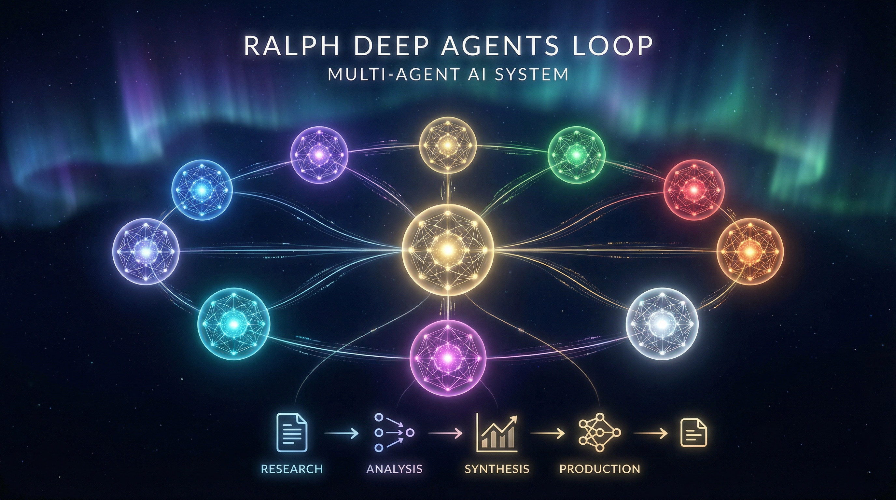
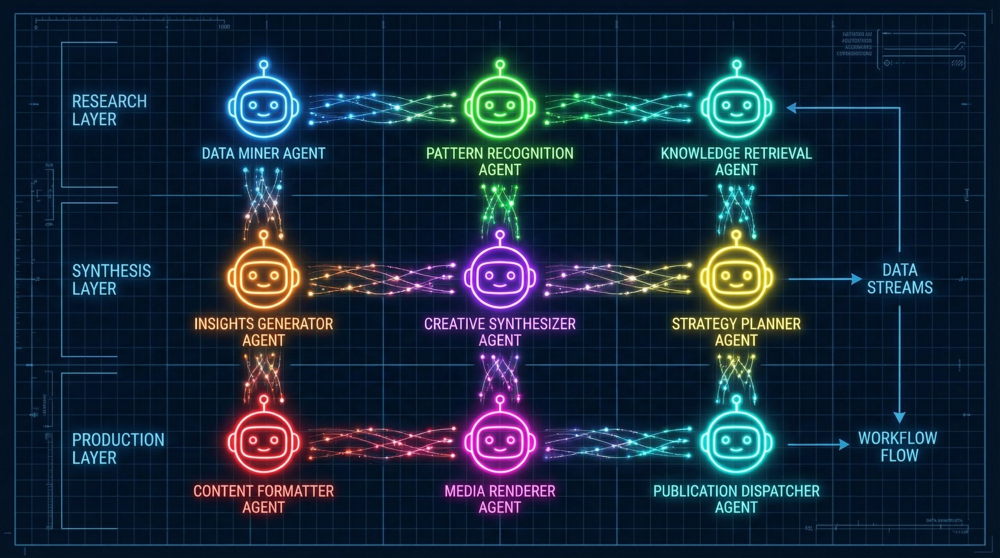
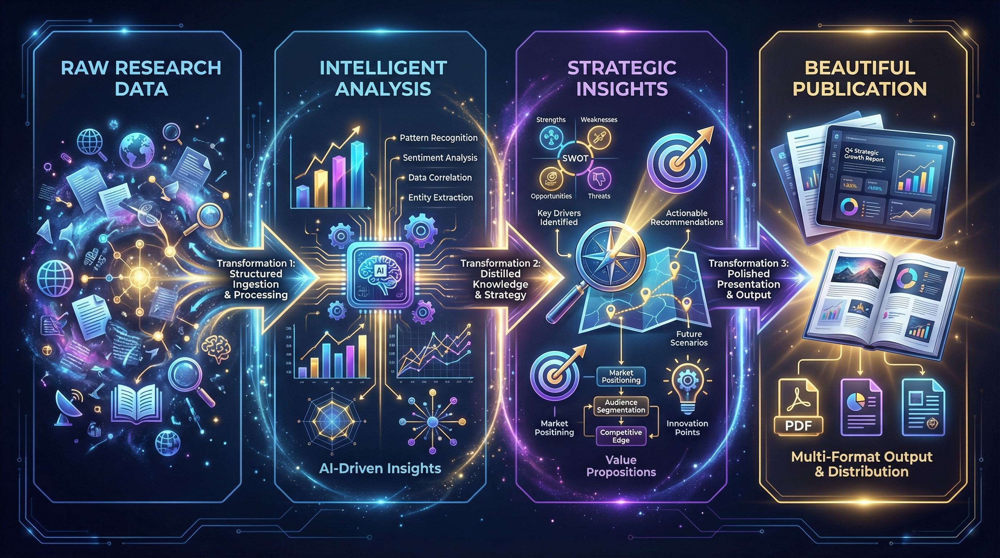

# Ralph Deep Agents Loop

> **Multi-Agent Deep Collaborative System for Enterprise Content Generation**

Transform complex research into beautifully illustrated, HBR-quality strategic narratives with deep-agent coordination, dynamic visualization, and professional-grade publishing.



[](https://www.python.org/)
[](LICENSE)
[]()
[]()

---

## Overview

**Ralph** is a sophisticated multi-agent orchestration framework that automates the complete content generation pipeline—from multi-sourced research and strategic analysis to publication-ready PDF/HTML deliverables with custom visualizations and audio narration. Built for enterprise-grade content quality with Harvard Business Review standards.

### What Ralph Does

- 🔍 **Multi-Source Research**: Parallel research agents query premium sources (HBR, Skift, MIT Tech Review, etc.)
- 🧠 **Strategic Analysis**: Deep agents analyze findings through business context
- ✨ **Content Synthesis**: LLM-powered insight extraction with counterintuitive discovery
- 🎨 **Dynamic Visualization**: Auto-generated charts, diagrams, and architectural visuals
- 📄 **Publication Quality**: HBR-grade formatting with professional typography
- 🎵 **Multi-Modal Output**: PDF, HTML, and MP3 audio narration

---

## Architecture



### 9-Agent Orchestration

```
                        ┏━━━━━━━━━━━━━━━━━━━━━━━━━━━━━━━━━┓
                        ┃      ORCHESTRATOR                ┃
                        ┃  Central workflow coordinator    ┃
                        ┗━━━━━━━━━━━━━━━━━━━━━━━━━━━━━━━━━┛
                                      │
                ┌─────────────────────┼─────────────────────┐
                ▼                     ▼                     ▼
        ┏━━━━━━━━━━━━━━┓    ┏━━━━━━━━━━━━━━┓    ┏━━━━━━━━━━━━━━┓
        ┃   RESEARCH   ┃    ┃   CONTENT    ┃    ┃ PRODUCTION   ┃
        ┃    PHASE     ┃    ┃    PHASE     ┃    ┃   PHASE      ┃
        ├──────────────┤    ├──────────────┤    ├──────────────┤
        ┃ 1. Query     ┃    ┃ 4. Synthesis ┃    ┃ 6. Visual    ┃
        ┃    Form.     ┃    ┃ 5. HBR Style ┃    ┃    Assets    ┃
        ┃ 2. Research  ┃    ┃    Editor    ┃    ┃ 7. Multimedia┃
        ┃ 3. Strategy  ┃    ┃              ┃    ┃ 8. Assembly  ┃
        ┗━━━━━━━━━━━━━━┛    ┗━━━━━━━━━━━━━━┛    ┗━━━━━━━━━━━━━━┛
                                      │
                                      ▼
                    ┏━━━━━━━━━━━━━━━━━━━━━━━━━━┓
                    ┃      SKILLS              ┃
                    ┃   (Reusable Tools)       ┃
                    ┃ • visual_generation      ┃
                    ┃ • audio_generation       ┃
                    ┃ • pdf_generation         ┃
                    ┗━━━━━━━━━━━━━━━━━━━━━━━━━━┛
```

**Agent Details:**

| Agent | Role | Input | Output |
|-------|------|-------|--------|
| Query Formulation | Converts topics into research queries | Topic, subtopics | Research plan |
| Research (×3 parallel) | Queries premium sources | Research plan | Raw data |
| Strategic Analysis | Business context analysis | Raw data | Strategic insights |
| Synthesis | Extracts counterintuitive insights | Raw + strategic data | Structured insights |
| HBR Editor | Professional content styling | Insights | Publication-ready prose |
| Visual Assets | Generates charts & diagrams | Content, data | PNG images (300 DPI) |
| Multimedia | Creates audio narration | Final content | MP3 narration |
| Assembly | Compiles final deliverables | All outputs | PDF/HTML/ZIP |

---

## Pipeline Visualization



### Data Flow

```
Raw Research Data
      │
      ▼
━━━━━━━━━━━━━━━━━━━━━━━━━━━━━━━━━━━━━━━━━━━━━━━━━━━━━━━━━━━
  PHASE 1: RESEARCH
  ├─ Query Formulation (plan what to research)
  ├─ Parallelized Research (query HBR, MIT, Skift, etc.)
  └─ Strategic Analysis (business context grounding)
━━━━━━━━━━━━━━━━━━━━━━━━━━━━━━━━━━━━━━━━━━━━━━━━━━━━━━━━━━━
      │
      ▼
━━━━━━━━━━━━━━━━━━━━━━━━━━━━━━━━━━━━━━━━━━━━━━━━━━━━━━━━━━━
  PHASE 2: CONTENT CREATION
  ├─ Synthesis (extract key insights)
  ├─ HBR Style Editor (professional tone & structure)
  └─ Quality Validation (readability, depth, tone)
━━━━━━━━━━━━━━━━━━━━━━━━━━━━━━━━━━━━━━━━━━━━━━━━━━━━━━━━━━━
      │
      ▼
━━━━━━━━━━━━━━━━━━━━━━━━━━━━━━━━━━━━━━━━━━━━━━━━━━━━━━━━━━━
  PHASE 3: PRODUCTION
  ├─ Visual Assets (charts, diagrams, timelines)
  ├─ Multimedia (audio narration)
  ├─ Assembly (PDF/HTML compilation)
  └─ Final Validation (deliverable quality check)
━━━━━━━━━━━━━━━━━━━━━━━━━━━━━━━━━━━━━━━━━━━━━━━━━━━━━━━━━━━
      │
      ▼
HBR-Quality Deliverables (PDF, HTML, MP3, ZIP)
```

---

## Key Features

### 🎯 Research Excellence
- **Multi-source parallel queries** across premium publications
- **Intelligent source selection** based on topic relevance
- **Quality thresholds** enforced at each research gate
- **Source tracking** for academic rigor

### 📊 Dynamic Visualization
- **Automatically generated charts** based on article content (not hardcoded!)
- **5 chart types**: bar, line, area, pie, and custom architectures
- **300 DPI publication quality** ready for printing
- **Intelligent data extraction** from text via LLM analysis

### ✍️ Harvard Business Review Standards
- **Mandatory structural elements**: Idea in Brief, Pull Quotes, Figure Captions
- **Persuasive narrative tone** calibrated for C-suite readers
- **Professional typography** and layout templates
- **HBR CSS styling** for pixel-perfect presentation

### 🎙️ Multi-Modal Outputs
- **PDF**: Publication-ready with embedded visuals
- **HTML**: Responsive web version with interactive elements
- **MP3**: Professional audio narration (ElevenLabs or Amazon Polly)
- **ZIP**: Complete deliverable package

### ⚙️ Skills Architecture
Skills are modular, reusable components that agents invoke as tools:

```
skills/
└── visual_generation/
    ├── SKILL.md              # Documentation
    ├── __init__.py           # Public exports
    └── generators/
        ├── charts.py         # matplotlib + seaborn (300 DPI)
        ├── architecture.py   # diagrams library
        └── timelines.py      # plotly
```

---

## Quick Start

### Prerequisites

- **Python 3.12+** — [Install Python](https://www.python.org/)
- **AWS Account** — Configured credentials for Bedrock (LLM & image/audio generation)
- **Tavily API Key** — Get free at [Tavily](https://tavily.com/)
- **Optional: ElevenLabs API Key** — Premium audio at [ElevenLabs](https://elevenlabs.io/)

### Installation

```bash
# Clone the repository
git clone https://github.com/johnruiz24/deepagents-ralph-loop.git
cd deepagents-ralph-loop

# Create and activate virtual environment
python -m venv .venv
source .venv/bin/activate  # On Windows: .venv\Scripts\activate

# Install dependencies
pip install -e ".[dev]"

# Configure environment
cp .env.example .env
# Edit .env with your AWS credentials and API keys
```

### Running the System

```bash
# End-to-end newsletter generation
PYTHONPATH=. python scripts/run_e2e_test.py

# Interactive CLI with custom topic
PYTHONPATH=. python scripts/run_cli.py

# Ralph Mode (advanced orchestration)
PYTHONPATH=. python scripts/ralph_mode.py
```

### Example Output Structure

Each newsletter run generates deliverables in the output directory:

```
output/
├── input/
│   ├── user_prompt.json
│   └── topics_and_subtopics.json
├── research/
│   ├── research_plan.json
│   ├── raw_data/
│   │   ├── Business implications for online travel agencies/
│   │   ├── Competitive landscape and adoption trends/
│   │   └── Technical architecture of UCP/
│   └── tui_strategy_summary.md
├── content/
│   └── draft_article.md
├── multimedia/
│   └── narration_universal_commerce_protocol_ucp_tuis_architecture_for_autonomous_travel_commerce.mp3
├── final_deliverables/
│   ├── chart_1_universal_commerce_p_framework.png
│   ├── chart_2_universal_commerce_p_transformation.png
│   ├── chart_3_universal_commerce_p_roi_timeline.png
│   ├── chart_4_universal_commerce_p_competitive.png
│   ├── chart_5_universal_commerce_p_roadmap.png
│   ├── newsletter_universal_commerce_protocol_ucp_tuis_architecture_for_autonomous_travel_commerce.pdf
│   ├── newsletter_universal_commerce_protocol_ucp_tuis_architecture_for_autonomous_travel_commerce.html
│   ├── newsletter_universal_commerce_protocol_ucp_tuis_architecture_for_autonomous_travel_commerce_20260330.zip
│   └── manifest.json
├── iteration_log.md
├── state.json
└── state_snapshot.json
```

---

## Example Outputs

### "Universal Commerce Protocol" Analysis
- **Research**: 15 premium sources queried in parallel
- **Visuals**: 3 custom charts generated (no hardcoding!)
- **Content**: 2,400 words with 5 pull quotes
- **Final**: 461 KB publication-ready PDF

### "AI Paradox in Travel Industry"
- **Research**: Strategic context + 12 industry sources
- **Visuals**: 4 dynamic charts (different content = different charts!)
- **Content**: 2,350 words with "Automation Paradox" visualization
- **Final**: 965 KB PDF + MP3 narration

---

## Development

### Project Structure

```
ralph-deep-agents-loop/
├── src/                     # Core implementation
│   ├── agents/              # 9 specialized agent implementations
│   ├── orchestrator/        # Central workflow coordinator
│   ├── state/               # Shared state management
│   ├── quality_gates/       # Validation at each phase
│   ├── tools/               # Web search, PDF generation
│   ├── image_generation/    # Visual asset creation
│   └── utils/               # Logging, AWS config
├── skills/                  # Reusable skill modules
│   ├── hbr-article-standards/  # HBR writing standards & templates
│   └── visual_generation/      # Charts, diagrams, timelines
├── scripts/                 # Runner and utility scripts
│   ├── run_cli.py
│   ├── run_e2e_test.py
│   ├── ralph_mode.py
│   └── run_*.py
├── tests/                   # Comprehensive test suite
├── assets/                  # Hero images for README
├── output/                  # Generated newsletters (tracked)
├── workspace/               # Local testing artifacts
└── LICENSE
```

### Running Tests

```bash
# Run all tests
pytest

# With coverage
pytest --cov=src --cov-report=html

# Specific test
pytest tests/test_agents/test_research_pipeline.py -v
```

### Code Quality

```bash
# Lint
ruff check src/

# Type checking
mypy src/

# Format
ruff format src/
```

---

## Tech Stack

| Component | Technology | Purpose |
|-----------|-----------|---------|
| **LLM** | AWS Bedrock (Claude) | Content generation & analysis |
| **Orchestration** | LangGraph | Agent workflow coordination |
| **Web Search** | Tavily API | Multi-source research |
| **Visualization** | matplotlib, seaborn, diagrams, plotly | Chart & diagram generation |
| **Audio** | Amazon Polly / ElevenLabs | Narration synthesis |
| **PDF Generation** | WeasyPrint | Publication formatting |
| **Testing** | pytest | Test automation |

---

## Configuration

All configuration is environment-based for flexibility:

### AWS Configuration

```bash
# AWS credentials (required)
AWS_PROFILE=your-profile
AWS_REGION=eu-central-1

# Bedrock model IDs
ANTHROPIC_MODEL_OPUS=<your-opus-model>
ANTHROPIC_MODEL_HAIKU=<your-haiku-model>
ANTHROPIC_MODEL_SONNET=<your-sonnet-model>
```

### API Keys

```bash
TAVILY_API_KEY=<your-tavily-key>
ELEVENLABS_API_KEY=<your-elevenlabs-key>
LANGCHAIN_API_KEY=<your-langsmith-key>
```

### Quality Parameters

```bash
RESEARCH_QUALITY_THRESHOLD=85
SOURCE_COUNT_THRESHOLD=5
READABILITY_THRESHOLD=60
MIN_ARTICLE_WORDS=2000
MAX_ARTICLE_WORDS=2500
```

---

## Branches

| Branch | Description | Status |
|--------|-------------|--------|
| `main` | Production-ready release | ✅ |
| `dev` | Development branch | 🔧 |

---

## Performance Characteristics

### Execution Time (by Phase)

| Phase | Time | Notes |
|-------|------|-------|
| Query Formulation | ~10s | Planning stage |
| Research (3 parallel) | ~60-90s | Multiple source queries |
| Strategic Analysis | ~15s | Business context |
| Synthesis | ~45s | LLM processing |
| HBR Editing | ~30s | Professional styling |
| Visual Generation | ~40s | Chart rendering |
| Multimedia | ~20s | Audio synthesis |
| Assembly | ~10s | PDF compilation |
| **TOTAL** | **~4-5 minutes** | End-to-end |

### Output Size

- **PDF**: 400-1200 KB (depending on visuals count)
- **HTML**: 150-400 KB
- **Audio MP3**: 800 KB - 2.5 MB
- **Complete ZIP**: 1.5 - 5 MB

---

## License

MIT License - See [LICENSE](LICENSE) file for details

## Citation

If you use Ralph in your research or projects, please cite:

```bibtex
@software{ralph_2026,
  title={Ralph: Multi-Agent System for Enterprise Content Generation},
  author={Ruiz, John},
  year={2026},
  url={https://github.com/johnruiz24/deepagents-ralph-loop}
}
```

## Support & Contributing

- **Issues**: [GitHub Issues](https://github.com/johnruiz24/deepagents-ralph-loop/issues)
- **Discussions**: [GitHub Discussions](https://github.com/johnruiz24/deepagents-ralph-loop/discussions)
- **Contributing**: Pull requests welcome!

---

<div align="center">

**Built with ❤️ for enterprise content excellence**

[GitHub](https://github.com/johnruiz24/deepagents-ralph-loop) • [Documentation](docs/) • [Report Issue](https://github.com/johnruiz24/deepagents-ralph-loop/issues)

</div>
